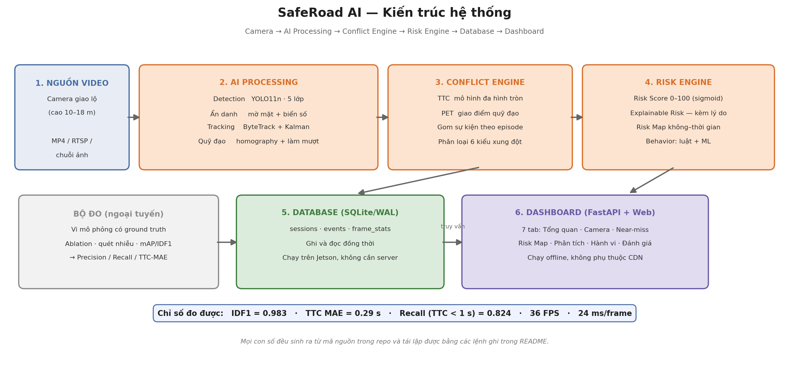

# SafeRoad AI

**Hệ thống AI phát hiện near-miss, phân tích rủi ro và xây dựng bản đồ an toàn giao thông**

Cuộc thi Sáng tạo trẻ Quốc gia trong lĩnh vực Trí tuệ nhân tạo 2026 — Bảng C

[]()
[]()
[]()

---

## Vấn đề

Quản lý an toàn giao thông ở Việt Nam đang chạy theo cơ chế **phản ứng**: một giao
lộ chỉ được coi là "điểm đen" sau khi đã đủ số vụ tai nạn được thống kê. Nghĩa là
dữ liệu để ra quyết định chỉ xuất hiện **sau khi đã có người thiệt mạng**.

Trong khi đó, trước mỗi vụ tai nạn có hàng trăm tình huống **suýt va chạm** mang
cùng cơ chế nguy hiểm nhưng kết thúc may mắn. Chúng diễn ra liên tục ngay trước
ống kính camera giao thông đã lắp sẵn — và không ai ghi nhận.

**SafeRoad AI biến luồng video giám sát sẵn có thành chỉ số rủi ro định lượng.**

---

## Kết quả đo được

Toàn bộ số liệu sinh ra từ mã trong repo này, tái lập được bằng các lệnh ở mục
[Chạy thử](#chạy-thử-5-phút).

| Chỉ số | Kết quả | Mục tiêu | |
|---|---:|---:|:--:|
| Tracking IDF1 | **0,983** | ≥ 0,70 | ✅ |
| Tracking MOTA | **0,965** | ≥ 0,60 | ✅ |
| TTC MAE | **0,290 s** | ≤ 0,30 s | ✅ |
| **Recall ở dải nguy hiểm nhất (TTC < 1 s)** | **0,824** | — | ✅ |
| Tốc độ xử lý | **44,5 FPS** | ≥ 25 FPS | ✅ |
| Độ trễ end-to-end | **19,9 ms/frame** | ≤ 1,5 s | ✅ |
| Conflict Recall (gộp mọi mức) | 0,638 | ≥ 0,80 | ❌ |
| Conflict Precision | 0,512 | ≥ 0,75 | ❌ |

**Hai chỉ số chưa đạt được báo cáo nguyên trạng.** Với detector hoàn hảo (nhiễu
0 px), hệ thống đạt F1 = 0,653 — nghĩa là ~0,10 điểm F1 mất do nhiễu detector,
phần còn lại là giới hạn của phương pháp. Phần lớn cảnh báo bị tính là sai thực
chất là các cặp xe có khoảng cách thật **dưới 1 m**: chúng đã đến rất gần nhau,
chỉ là không thoả toàn bộ tiêu chí của nhãn chuẩn. Ranh giới giữa "dòng xe đông"
và "xung đột" vốn mờ — đây là hiện tượng đã được ghi nhận trong tài liệu nghiên
cứu traffic conflict technique.

Phân tích đầy đủ: [`docs/BaoCao_SafeRoadAI_BangC.pdf`](docs/BaoCao_SafeRoadAI_BangC.pdf) mục 8.

---

## Kiến trúc



| Khối | Chức năng | Công nghệ |
|---|---|---|
| 1. Nguồn video | Thu nhận luồng hình ảnh | MP4 / RTSP / chuỗi ảnh |
| 2. AI Processing | Phát hiện · ẩn danh · theo vết · quỹ đạo mặt đất | YOLO11n · ByteTrack · Kalman · Homography |
| 3. Conflict Engine | TTC/PET · gom episode · phân loại xung đột | Mô hình đa hình tròn |
| 4. Risk Engine | Risk Score · Explainable Risk · bản đồ nhiệt | Sigmoid có trọng số |
| 5. Database | Lưu trữ bền vững, đọc/ghi song song | SQLite chế độ WAL |
| 6. Dashboard | 7 tab trực quan, chạy ngoại tuyến | FastAPI · HTML/Canvas thuần |

---

## Cài đặt

```bash
git clone https://github.com/dangkhoi-dev/SafeRoad-AI.git
cd SafeRoad-AI

python -m venv .venv
source .venv/bin/activate          # Windows: .venv\Scripts\activate

pip install -e ".[dev,docs]"      # [dev,docs] = pytest + thư viện sinh báo cáo
python scripts/download_assets.py  # tải trọng số YOLO11n (~5,6 MB)
```

Yêu cầu: Python ≥ 3.10. Chạy được trên CPU; có GPU thì nhanh hơn.

---

## Chạy thử (5 phút)

Không cần tải dataset — hệ thống **tự sinh dữ liệu kiểm chứng**:

```bash
# 1. Sinh video mô phỏng + nhãn chuẩn (~2 phút)
python -m saferoad simulate --duration 300 --seed 42

# 2. Chạy pipeline end-to-end (~1 phút)
python -m saferoad run --config configs/synthetic.yaml \
    --ground-truth data/samples/synthetic_groundtruth.pkl --replay-detections

# 3. Chấm điểm + bảng ablation (~3 phút)
python -m saferoad evaluate

# 4. Mở dashboard
python -m saferoad serve
#   → http://127.0.0.1:8000
```

Chạy trên video của bạn:

```bash
python -m saferoad run --source video_cua_ban.mp4 --anonymize
```

---

## Dùng với dataset thật

```bash
# Sắp xếp dữ liệu đã tải về vào cấu trúc chuẩn (xem trước trước khi làm thật)
python scripts/organize_dataset.py --source D:\SV7 --dry-run
python scripts/organize_dataset.py --source D:\SV7

# Dựng video + nhãn từ Multi-view Traffic Intersection Dataset
python -m saferoad prepare-real --root data/raw/mvti --view Infrastructure

# Chấm mAP detection + IDF1 tracking trên ảnh thật
python -m saferoad evaluate-real
```

---

## Toàn bộ lệnh

| Lệnh | Chức năng |
|---|---|
| `saferoad simulate` | Sinh video mô phỏng + nhãn chuẩn near-miss |
| `saferoad run` | Chạy pipeline end-to-end trên một video |
| `saferoad evaluate` | Chấm Precision/Recall/TTC-MAE + bảng ablation |
| `saferoad serve` | Bật dashboard web |
| `saferoad anonymize` | Ẩn danh video (làm mờ mặt, biển số) |
| `saferoad train-behavior` | Huấn luyện bộ phân loại hành vi |
| `saferoad prepare-real` | Dựng video + nhãn từ dataset thật (MVTI) |
| `saferoad evaluate-real` | Chấm mAP + IDF1 trên dữ liệu thật |

---

## Bốn quyết định kỹ thuật đáng chú ý

### 1. Tự viết trình mô phỏng vì không dataset nào có nhãn near-miss

Mọi dataset giao thông công khai chỉ có bounding box. Mà Precision/Recall của
phát hiện xung đột lại là cam kết trung tâm của đề tài.

Trình mô phỏng chạy vi mô phỏng thật — đèn tín hiệu hai pha, car-following IDM,
gap acceptance cho xe rẽ, phanh tránh khẩn cấp. Near-miss **phát sinh** từ đúng
nguyên nhân ngoài đời (vượt đèn đỏ, rẽ cắt dòng, người đi bộ băng qua), không có
tình huống nào được dàn dựng thủ công.

Nhãn chuẩn được tính bằng quy trình **khác** thuật toán online: 60 Hz thay vì
30 Hz, vận tốc giải tích thay vì ước lượng từ bbox nhiễu, cực tiểu toàn cục thay
vì quyết định từng khung hình. Nhờ đó đây là nhãn độc lập, không phải thuật toán
tự chấm điểm cho chính nó.

### 2. Mô hình đa hình tròn thay cho hình tròn ngoại tiếp

Hình tròn ngoại tiếp một ô tô 4,4 × 1,8 m có bán kính 2,38 m — tức là mô hình hoá
chiếc xe như vật thể **rộng 4,76 m**. Hậu quả đo được: hai ô tô đi ngược chiều ở
hai làn cách nhau 4 m bị gắn nhãn "đối đầu", sinh ra **132 cảnh báo giả trong 120
giây** cho dòng xe hoàn toàn bình thường.

Phủ thân xe bằng 1–3 hình tròn nhỏ dọc trục (bán kính = nửa bề rộng xe) đưa con
số đó xuống còn **13**, mà vẫn giữ được công thức TTC dạng đóng.

### 3. Gom sự kiện theo episode, gán nhãn tại đỉnh nguy hiểm

Một tình huống suýt va chạm kéo dài 1–2 giây. Ở 30 FPS, phát sự kiện mỗi khung
hình sẽ biến **một** tình huống thành 30–60 "sự kiện".

Hệ thống theo dõi cả episode, đóng lại khi điều kiện chấm dứt, rồi phát **một**
sự kiện duy nhất gán nhãn tại **thời điểm TTC nhỏ nhất**. Riêng thay đổi này nâng
Recall từ 0,18 lên 0,42.

### 4. Cổng khoảng cách — thành phần có tác dụng lớn nhất

TTC chỉ là một **phép ngoại suy**. Nếu một bên kịp phanh và hai xe chưa bao giờ
tới gần nhau, đó là tình huống được xử lý **tốt**, không phải sự cố.

Thêm điều kiện "hai xe phải thực sự đến gần nhau" làm Precision tăng **gấp hơn
năm lần** (0,09 → 0,51) trong khi Recall gần như không đổi:

| Cấu hình | Precision | Recall | F1 |
|---|---:|---:|---:|
| Detection + Tracking | 0,000 | 0,000 | 0,000 |
| + Homography | 0,062 | 0,768 | 0,114 |
| + Làm mượt quỹ đạo | 0,110 | 0,609 | 0,186 |
| + PET | 0,093 | 0,725 | 0,165 |
| **+ Cổng khoảng cách** | **0,512** | **0,638** | **0,568** |

---

## Một phát hiện về YOLO trên camera giao thông

Đo trực tiếp trên ảnh giao lộ thật, YOLO11n với trọng số COCO gốc chỉ đạt
**recall@0.5 ≈ 0,19**. Trong một khung hình thử, model phát hiện đúng **một** vật
thể và gán nhầm nhãn `train` cho một chiếc ô tô.

Nguyên nhân không phải model yếu mà là **lệch miền**: COCO chủ yếu là ảnh chụp
ngang tầm mắt, còn camera giao thông đặt cao 10–18 m nhìn chếch xuống.

| Cấu hình | recall@0.5 |
|---|---:|
| YOLO11n COCO, imgsz 640 | 0,19 |
| YOLO11n COCO, imgsz 1600, conf 0,10 | 0,31 |
| **YOLO11n COCO + cắt ô 2×3 (SAHI)** | **0,46** |

Cắt ô là giải pháp trước mắt (`detection.backend: tiled`). Giải pháp căn cơ là
fine-tune — xem [`notebooks/01_finetune_yolo11n_colab.ipynb`](notebooks/01_finetune_yolo11n_colab.ipynb).

---

## Cấu trúc thư mục

```
SafeRoad-AI/
├── src/saferoad/
│   ├── types.py              # kiểu dữ liệu lõi, mô hình đa hình tròn
│   ├── config.py             # toàn bộ ngưỡng kỹ thuật ở một chỗ
│   ├── cli.py                # giao diện dòng lệnh
│   ├── detection/            # YOLO + suy luận theo ô
│   ├── tracking/             # ByteTrack + Kalman (tự cài đặt)
│   ├── geometry/             # homography, làm mượt quỹ đạo
│   ├── conflict/             # TTC, PET, gom episode
│   ├── risk/                 # Risk Score, Risk Map, Explainable Risk
│   ├── behavior/             # phân loại hành vi rule + ML
│   ├── privacy/              # ẩn danh mặt & biển số
│   ├── simulation/           # vi mô phỏng + camera pinhole + oracle
│   ├── evaluation/           # ablation, mAP, IDF1/MOTA
│   ├── data/                 # bộ nạp dataset thật
│   ├── storage/              # SQLite
│   ├── pipeline/             # điều phối + overlay
│   └── dashboard/            # FastAPI + giao diện web
├── configs/                  # default · synthetic · hangxanh · mvti
├── notebooks/                # fine-tune YOLO trên Colab
├── scripts/                  # sắp xếp dữ liệu, xuất YOLO, dựng báo cáo
├── tests/                    # 78 test
└── docs/                     # báo cáo, protocol, kê khai, kịch bản video
```

---

## Tài liệu

| Tài liệu | Nội dung |
|---|---|
| [`docs/BaoCao_SafeRoadAI_BangC.pdf`](docs/BaoCao_SafeRoadAI_BangC.pdf) | Tài liệu dự án Bảng C — 13 mục, 13 trang |
| [`docs/protocol_near_miss_v1.md`](docs/protocol_near_miss_v1.md) | Định nghĩa chính thức near-miss dùng làm ground truth |
| [`docs/dataset_license.md`](docs/dataset_license.md) | Bảng kê nguồn dữ liệu và điều kiện bản quyền |
| [`docs/ke_khai_cong_cu.md`](docs/ke_khai_cong_cu.md) | Kê khai công cụ AI / dataset / thư viện |
| [`docs/prompt_log.md`](docs/prompt_log.md) | Prompt Log + nhật ký quyết định kỹ thuật |
| [`docs/video_script.md`](docs/video_script.md) | Kịch bản quay 2 video theo từng phút |

---

## Kiểm thử

```bash
pytest tests/ -q          # 78 test
```

Bộ test kiểm tra những chỗ **dễ sai nhất**, không chỉ chạy cho có:

- TTC/PET đúng trên các tình huống tính tay được;
- hai xe đi ngược chiều ở hai làn cạnh nhau **không** phải xung đột;
- một episode kéo dài sinh **đúng một** sự kiện;
- mô phỏng **không bị tắc nghẽn** (từng có lỗi khiến cả nút giao khoá chết);
- xe **không đi xuyên qua nhau**;
- một dự đoán **không** được khớp với hai nhãn chuẩn.

---

## Giấy phép

Mã nguồn: **MIT**.

⚠️ Ultralytics YOLO dùng **AGPL-3.0** — có tính lây lan. Dùng cho nghiên cứu và dự
thi thì hợp lệ; nếu thương mại hoá cần mua giấy phép doanh nghiệp hoặc thay
detector. Kiến trúc đã tách `BaseDetector` thành giao diện riêng để việc thay thế
chỉ cần cài đặt một lớp con.

Trích dẫn bắt buộc khi dùng UCSD Highway Traffic Database:

> A. B. Chan and N. Vasconcelos, "Probabilistic Kernels for the Classification of
> Auto-Regressive Visual Processes", *IEEE CVPR*, San Diego, 2005.

---

## Nhóm thực hiện

**Trần Phan Đăng Khôi** (KHMT, đội trưởng) · **Mạnh Anh** (Robot) · **Huynh Hân** (QTKD)
